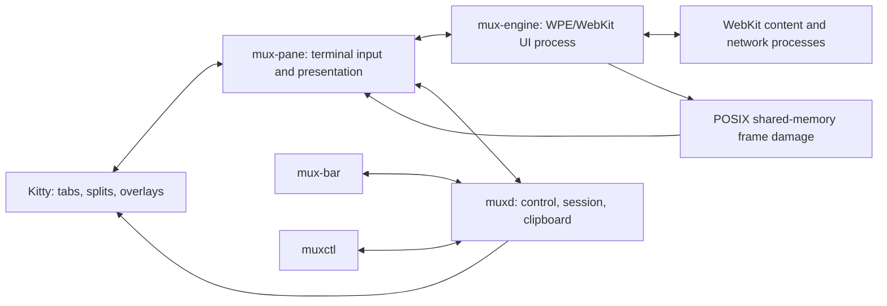

# Mux architecture

Status: current v0.1 architecture and explicit post-v0.1 targets
Runtime: local Linux desktop inside a dedicated Kitty instance

This document describes the implementation that exists now. Items described as
targets are not executable promises. In particular, Mux does not yet recreate a
saved Kitty layout, relaunch offline panes, or reattach a live DOM after an
engine or pane restart.

## 1. Decision

Use Kitty directly as both the terminal and the multiplexer. A Kitty window
runs one `mux-pane` per page. The pane captures terminal input, presents frames
through Kitty graphics, and connects to both `muxd` and a profile-specific
`mux-engine`. There is no nested tmux-style graphics pass-through layer.

Use WPE WebKit rather than implementing a browser engine. `mux-engine` owns the
WPE/WebKit UI process and leaves HTML, JavaScript, networking, storage, service
workers, TLS, media, and renderer process isolation to WebKit.

The Nix flake is the reproducible packaging target. Its pinned dependency graph
and custom WPE derivation still require a successful full build before
`nix run .` should be treated as release-proven on every declared architecture.
The source launcher remains available for development and local use.

## 2. Scope

### Included

- Ordinary modern sites supported by the packaged WPE WebKit.
- One local user, one persistent default profile, and isolated ephemeral panes.
- Multiple pages sharing a profile's cookies, cache, storage, and service
  workers through one profile engine.
- Kitty tabs, splits, layouts, overlays, and key mappings.
- A layer-local URL bar and trusted terminal overlays.
- Stable page IDs, logical layer metadata, and last-URL recovery.
- Downloads, permissions, file selection, clipboard bridging and history, TLS
  handling, and crash recovery.
- Bounded frame, terminal-output, daemon-output, and collection queues.

### Deliberately excluded from v0.1

- tmux, Zellij, WezTerm, or a multiplexer compatibility layer.
- macOS and Windows runtime support.
- Remote or collaborative sessions.
- Browser extensions and a public plugin API.
- DRM/EME compatibility promises.
- A custom HTTP stack, cookie jar, cache, or web engine.
- Perfect high-frame-rate video, games, WebGPU, or full-screen WebGL.
- Screen-reader-grade accessibility from a raster terminal surface.
- Automatic Kitty layout restoration or live page reattachment.

This is a personal browser shell, not a browser platform. Features should be
added when they improve daily use, not merely to reproduce every preference in
a conventional browser.

## 3. Runtime and distribution

The launchers perform the following work:

1. Validate or create owner-only XDG runtime and state directories.
2. Start or discover `muxd`.
3. Start a dedicated Kitty instance with the Mux configuration.
4. Give Kitty an owner-only filesystem control socket and a scoped remote
   control password.
5. Start `mux-layer`, which creates `mux-bar` and an initial `mux-pane`.
6. Let each pane discover or idempotently start its profile's `mux-engine`.

The allowed Kitty remote-control actions are limited to `detach-window`,
`focus-window`, and `launch`. Mux does not expose an abstract socket and does
not enable unrestricted remote control in the user's normal Kitty instances.

State follows XDG conventions:

```text
$XDG_RUNTIME_DIR/mux/        owner-only sockets and transient runtime state
$XDG_CONFIG_HOME/mux/        optional personal configuration
$XDG_DATA_HOME/mux/          profiles, session metadata, and browser records
$XDG_CACHE_HOME/mux/         build cache and disposable diagnostics
```

WebKit website data lives in profile-specific data and cache directories. A
normal launch starts a new visible layer. Persisted offline records are not
automatically relaunched or arranged into their previous Kitty layout.

## 4. Object model

| Kitty concept | Mux concept | Current behavior |
| --- | --- | --- |
| Dedicated OS window | Attached Mux UI | v0.1 assumes one dedicated Kitty instance. |
| Tab | Logical layer | Contains a bar and one or more page panes. |
| Window/split | Page attachment | Runs `mux-pane`; it does not own WebKit. |
| Overlay | Trusted prompt | Rendered by Mux, never by page-controlled terminal escapes. |
| Kitty window ID | Presentation identity | Used only while that Kitty window is live. |
| Mux view ID | Stable page metadata ID | Survives abrupt pane loss and can be reclaimed. |

Moving a live Kitty window preserves its running pane and engine view. Replacing
an engine or reconstructing a pane reloads the last known URL; it does not
preserve DOM, form, scroll, in-page history, media, or JavaScript state.

## 5. Process architecture



Pixel bytes never travel through the terminal PTY or `muxd`. `mux-engine`
copies a frame region into a mode-0600 POSIX shared-memory object and sends its
descriptor to `mux-pane`. The pane queues a small Kitty graphics command; Kitty
opens the object and returns a correlated response before the pane acknowledges
the engine frame.

### `muxd`

`muxd` is the browser control plane. It owns:

- The live pane registry, active view, logical layers, and state revision.
- Stable Mux view IDs and persistent recovery metadata.
- Control and subscription routing for `muxctl`, `mux-bar`, and panes.
- Central clipboard snapshots, profile isolation, and clipboard history.
- Kitty focus, launch, and physical move orchestration.
- Owner-only local IPC and peer-credential checks.

It does not link WebKit, own Web views, import render buffers, or produce page
frames.

All accepted daemon sockets are nonblocking. Outbound records use ordered,
bounded per-client queues with partial-write tracking; a stalled client is
disconnected rather than allowed to block the daemon.

### `mux-engine`

One `mux-engine` runs per profile. It owns:

- The WPE display and WebKit UI-process objects.
- Persistent or ephemeral WebKit network sessions and website data.
- Web view creation, navigation, opener relationships, and lifecycle.
- Browser policy for permissions, downloads, file selection, TLS, authentication,
  external schemes, and web-process crashes.
- WPE buffer import, damage coalescing, frame memory accounting, and shared-memory
  frame production.
- Browser history, bookmark, recently-closed, and permission records scoped to
  the profile.

WebKit still owns its sandboxed content and network processes.

### `mux-pane`

`mux-pane` is the thin Kitty-facing process. It:

- Enables the Kitty keyboard protocol, focus reporting, and pixel mouse input.
- Reports viewport size, scale, focus, and explicit visibility to `mux-engine`.
- Forwards keyboard, text, pointer, wheel, resize, focus, and navigation events.
- Receives frame descriptors and emits Kitty shared-memory graphics commands.
- Maintains the trusted overlays and sanitized terminal-facing metadata.
- Uses one bounded nonblocking PTY queue for graphics, trusted UI, and clipboard
  OSC traffic.
- Reconnects to `muxd` and `mux-engine`; engine replacement reloads the URL.

It never receives HTML or JavaScript and never emits terminal escapes assembled
from unsanitized page strings.

### `muxctl`

The implemented command names are exactly:

```text
status
list
active
focus
open
back
forward
reload
quit
layer
move
```

There is no v0.1 `prompt`, `stop`, `new-page`, `new-layer`, `close`, `watch`, or
`restore` command. The URL bar is a dedicated `mux-bar` process rather than a
`muxctl prompt` mode.

## 6. Kitty integration

Kitty supplies tabs, splits, layouts, overlays, shared-memory graphics, pixel
mouse reporting, its extended keyboard protocol, and documented remote control.
Mux does not use undocumented in-process Kitty APIs.

The launcher creates a filesystem socket below an owner-only runtime directory.
Kitty remote control requires the launcher-provided password and restricts it to
the three actions Mux needs: `detach-window`, `focus-window`, and `launch`.
Page content cannot read or modify those credentials.

### URL bar

`mux-bar` subscribes to `muxd` and displays the active page's sanitized URL and
state for its layer. `Super+L` (`Ctrl+L` Linux alias) asks `muxd` to focus that
registered bar. Enter
sends the entered location as a structured control record; Escape cancels and
returns focus. User input is never interpolated into a shell command.

### Layers and moves

A Kitty tab represents a logical layer and contains a persistent bar plus page
splits. `muxd` owns logical membership; it does not infer it from tab titles.

Focusing a layer uses Kitty's documented `focus-window` action. A physical
`move` uses `detach-window` only when a live target pane exists in the requested
layer on the same Kitty control socket. Empty target layers and cross-Kitty
moves fail without changing metadata. Reconstructing missing tabs from saved
logical layer records is future work.

## 7. Rendering and frame transport

The WPE-to-Kitty path is:

1. WebKit submits a `WPEBuffer` and damage rectangles to `mux-engine`.
2. A hidden view releases the buffer without importing or copying its pixels.
3. For a visible view, the engine waits for any render fence, imports the
   buffer, updates its retained RGBA surface, and coalesces damage.
4. The engine copies the outgoing region into a uniquely named mode-0600 POSIX
   shared-memory object and sends a `FRAME` descriptor to `mux-pane`.
5. The pane admits the complete Kitty command to its bounded nonblocking PTY
   queue and records the frame serial and image generation.
6. Kitty consumes the shared-memory object and sends a graphics response.
7. The pane correlates that response and sends `FRAME_ACK` for the matching
   engine frame.
8. The engine releases the frame gate and unlinks any remaining object name.

Only one engine frame per view is outstanding. New damage is coalesced rather
than queued as stale animation frames. Late Kitty responses cannot acknowledge
a newer image generation. A frame left unacknowledged for 30 seconds is treated
as a failed presentation connection and triggers fail-closed recovery.

The transport does not encode PNGs, base64-encode pixel data, poll pages, or
push unchanged frames. Base64 is used only where Kitty requires textual
encoding of short protocol fields such as the shared-memory object name.

## 8. Input and visibility

| Event | Path |
| --- | --- |
| Keyboard/text | Kitty protocol -> `mux-pane` -> WPE input event |
| Pointer/buttons | SGR pixel coordinates -> `mux-pane` -> WPE pointer event |
| Wheel | Kitty event -> `mux-pane` -> WPE scroll event |
| Resize | terminal dimensions -> `mux-pane` -> WPE viewport resize |
| Focus | terminal focus event -> `SET_FOCUS` |
| Layer visibility | daemon/layer state -> `SET_VISIBILITY` |

Visibility is independent of focus. Hiding a pane retires its pending frame and
surface, and the engine suppresses pixel import, conversion, shared-memory
allocation, and frame emission. Showing it resets presentation and requests a
fresh full frame without reloading the page. This is rendering suppression, not
page suspension: JavaScript, networking, audio, and media may continue while a
layer is hidden.

Full IME preedit remains limited by what a terminal input protocol can expose.
Committed Unicode text and physical key events are the supported baseline.

## 9. Local protocols

Mux has two separate local protocol boundaries.

### Control/session/clipboard protocol

`muxd` listens on an owner-only Unix stream socket. Records are newline
delimited; structural fields are separated from base64-encoded user strings.
Linux peer credentials must match the daemon UID. Every client has a bounded
ordered output queue, partial writes resume through `POLLOUT`, and control
responses drain before their connection closes.

### Pane/engine protocol

`mux-engine` listens on a profile-specific owner-only `SOCK_SEQPACKET` socket
whose path includes protocol version 2, for example:

```text
$XDG_RUNTIME_DIR/mux/mux-engine-v2-default.sock
```

The fixed binary envelope begins with `MUX1` and version 2. Packets, dimensions,
counts, and shared-memory sizes are bounded before use. `SO_PEERCRED` must match
the engine UID, and the PID claimed by `HELLO` must match the kernel-reported
peer PID. Version mismatch fails the handshake instead of entering a reconnect
loop.

Version 2 includes navigation, input, frame acknowledgement, explicit
`SET_FOCUS`, explicit `SET_VISIBILITY`, and serial-bound graceful-close records:
`REQUEST_CLOSE`, `CANCEL_CLOSE`, and `CLOSE_READY`.

## 10. Lifecycle and persistence

| State | WebKit view | Presentation |
| --- | --- | --- |
| Visible | live | Frames are produced within bounded budgets. |
| Hidden | live | Pixel import and frame presentation are suppressed. |
| Pane disconnected | may be recreated | `muxd` retains recovery metadata. |
| Engine replaced | recreated from URL | DOM and JavaScript state are lost. |
| Explicitly closed | destroyed | Clean `BYE` removes the live record. |

The first `Super+Q` (`Ctrl+Q` Linux alias) requests WebKit's graceful close path
so `beforeunload` can
run. If WebKit permits closure, the engine sends serial-matched `CLOSE_READY`.
If the page chooses Stay or the request times out, the pane sends
`CANCEL_CLOSE`, retires the request, and remains open. A second `Super+Q` while a
request is pending is the explicit force-close operation.

Persistent session metadata includes logical layer, stable view ID, last known
URL, and profile association. Ephemeral/private panes are excluded. This state
supports identity reclaim and URL recovery after abrupt loss.

Automatic workspace restoration is not implemented in v0.1. Mux does not yet:

- Relaunch all offline panes at startup.
- Recreate Kitty tabs, splits, or layout geometry.
- Reattach a retained live WebKit view after process replacement.
- Restore DOM, form, scroll, JavaScript, or in-page navigation state.

Those are target capabilities only.

## 11. Browser-shell responsibilities

An engine is not a usable browser shell by itself. `mux-engine` and the trusted
pane UI handle:

- New windows and opener policy.
- Downloads and file chooser requests.
- Clipboard access and Mux clipboard history.
- Permissions and private-profile boundaries.
- TLS and HTTP authentication failures.
- External URL schemes.
- Web-process crashes.
- Before-unload and unsaved-form warnings.
- External-browser fallback.

Privileged requests need an explicit trusted deny path. Web content never gains
a generic shell or terminal-control bridge.

## 12. Performance rules

A 1200 by 800 RGBA page at 30 FPS represents about 115 MB/s of pixel copies.
Shared memory removes pixel base64 and PTY transfer, but not memory bandwidth.

Current invariants are:

- One submitted frame per view; later damage is coalesced.
- No pixel import or frame transport for hidden panes.
- Full frames after attach, resize, show, or transport recovery.
- A bounded aggregate engine frame-memory budget.
- A bounded nonblocking pane PTY queue with reserved frame-command capacity.
- Bounded nonblocking daemon queues so a stalled client cannot freeze control,
  session, or clipboard work.
- Cleanup of retired or timed-out shared-memory objects.

Further rectangle preservation, buffer reuse, and refresh-rate tuning are
measurement-driven optimizations, not architectural prerequisites.

## 13. Security floor

Mux must:

- Keep WebKit's sandbox and multiprocess architecture enabled.
- Track security-patched WPE releases through pinned dependencies.
- Restrict runtime sockets, profiles, shared memory, and staging directories to
  the current user.
- Authenticate local peers and bound every message, queue, dimension, count,
  path, and allocation.
- Sanitize all page-controlled terminal text and assemble escapes only from
  validated fields.
- Never provide JavaScript with a shell, Kitty, or native-IPC bridge.
- Keep the dedicated Kitty control socket on the filesystem below an owner-only
  directory and limit its password to required actions.
- Require trusted policy handling for permissions, downloads, file access, TLS,
  authentication, and external schemes.

Same-UID processes are inside the v0.1 local trust boundary. Cross-user access
is not.

## 14. Compatibility boundaries

Expected limitations include:

- DRM services without a licensed content-decryption module.
- Chromium-only or extension-dependent sites.
- Host media codecs unavailable to WPE/GStreamer.
- OAuth providers that reject embedded browsers.
- High-damage games, WebGL, WebGPU, and video.
- Full IME composition and accessibility through raster output.
- Sites with browser-specific identity checks.

## 15. Repository shape

The current implementation is intentionally concentrated rather than split
into speculative future packages:

```text
mux, setup, doctor
flake.nix, flake.lock
kitty/
docs/
spikes/wpe-kitty/
  src/                 muxd, muxctl, mux-bar, mux-layer, mux-engine, mux-pane
  tests/
```

The earlier synthetic Kitty transport was a historical spike. It established
the shared-memory graphics direction, but it is not the current browser launch
path. WPE/WebKit is already part of the implementation; the former instruction
to avoid adding WPE no longer applies.

## 16. Remaining architecture targets

- Prove the full pinned Nix WPE build on each declared architecture.
- Add automatic, explicit workspace restoration without overstating URL reload
  as live page preservation.
- Improve damage-rectangle transport and shared-memory reuse from measurements.
- Suspend more hidden-page work only where WebKit exposes reliable policy.
- Add graphical integration coverage for Kitty, WPE rendering, input, and
  trusted browser prompts.

## 17. Primary references

- [Kitty remote control](https://sw.kovidgoyal.net/kitty/remote-control/)
- [Kitty launch and overlays](https://sw.kovidgoyal.net/kitty/launch/)
- [Kitty graphics protocol](https://sw.kovidgoyal.net/kitty/graphics-protocol/)
- [Kitty keyboard protocol](https://sw.kovidgoyal.net/kitty/keyboard-protocol/)
- [WPE WebKit developer documentation](https://wpewebkit.org/developers/)
- [WPEPlatform API](https://wpewebkit.org/reference/stable/wpe-platform-2.0/)
- [WPE WebKit releases](https://wpewebkit.org/release/)
